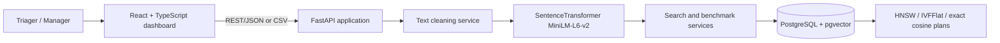
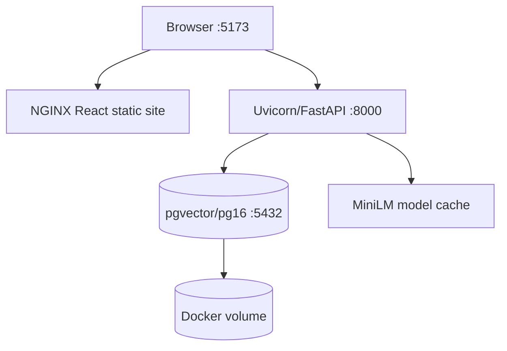
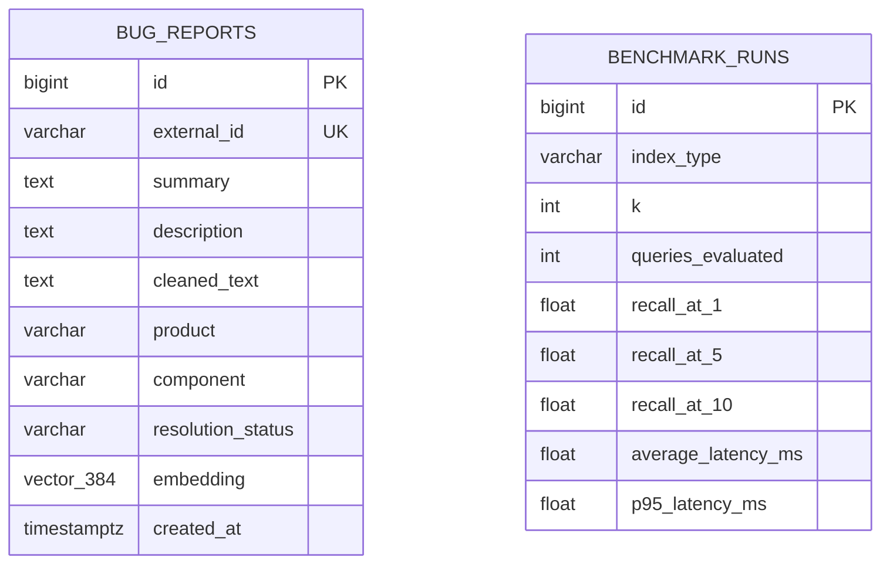

# D.4.2 Analysis and Design Document

**Project:** AI Bug Deduplication System using PostgreSQL pgvector  
**Course:** COMP.8157 Advanced Database Topics | **Version:** 1.0

## 1. Context, goals, and non-goals

Duplicate bug detection is an information-retrieval problem: two reports may describe one failure without sharing the same keywords. Traditional lexical search is therefore insufficient. This design uses sentence embeddings so semantically similar descriptions occupy nearby positions in a vector space. Crucially, vector persistence and nearest-neighbour retrieval occur inside PostgreSQL through pgvector, which keeps relational metadata filtering and vector ranking in one query path.

Goals are: (1) rank related reports using cosine similarity; (2) compare exact, HNSW, and IVFFlat retrieval; (3) allow Bugzilla CSV ingestion; and (4) expose a usable web interface and repeatable deployment. Success is demonstrated when a user can import data, search top-K candidates, and run a benchmark that persists Recall@1/@5/@10 and latency metrics. The system does not train a new model, resolve tickets automatically, or replace human triage.

## 2. Logical architecture



The React client has four views: Home/import, Search, Benchmarks, and About. FastAPI provides transport-level validation and OpenAPI documentation. `services.py` contains the business workflow: cleaning, lazy model loading, embedding, query construction, and evaluation. SQLAlchemy/psycopg connect the service to PostgreSQL. Database scripts own physical schema/index creation rather than application start-up, enabling controlled DBA deployment.

## 3. Physical architecture



Docker Compose defines three services: `db` from `pgvector/pgvector:pg16`, `api` from Python 3.12, and `web` from NGINX. The database volume retains vectors and benchmark history. On first initialization it runs `production_schema.sql` then `production_indexes.sql`. In a production environment, database port 5432 should not be exposed publicly and the model cache should be mounted or prebuilt for predictable startup.

## 4. Data model and flow



Import flow: the CSV parser maps Bugzilla fields to a validated `BugCreate` object; `clean_text` unescapes HTML, removes tags/URLs, and collapses whitespace; MiniLM produces a unit-normalized 384-vector; SQLAlchemy inserts one `bug_reports` row. Search flow: the query is cleaned/embedded using the same pipeline; optional product/component predicates filter rows; pgvector's cosine-distance operator orders candidates; similarity is calculated as `1 - cosine_distance`.

`external_id` prevents duplicate source imports when populated. `bug_reports_updated_at` maintains `updated_at`. Relational B-tree indexes support filters; `vector_cosine_ops` supports cosine ANN indexes. IVFFlat must be created after a representative import because it trains centroids from current data.

## 5. Component design and algorithms

**Duplicate retrieval pseudocode**

```text
function search(query, k, product, component, indexType):
  validate indexType
  vector = normalize(MiniLM(clean(query)))
  set HNSW ef_search or IVFFlat probes for the transaction
  SELECT bug, 1 - (embedding <=> vector) AS similarity
  FROM bug_reports
  WHERE product/component match when supplied
  ORDER BY embedding <=> vector
  LIMIT k
  return ranked rows
```

**Benchmark pseudocode**

```text
for each sampled report q:
  approximate = search(q.cleaned_text, top 10, selected index)
  exact = SQL cosine search with index scans disabled
  for n in [1,5,10]: record whether exact[:n] intersects approximate[:n]
  record elapsed milliseconds
persist mean latency, p95 latency, and hit_count/query_count per n
```

Recall@K is the proportion of sampled queries for which the approximate top-K overlaps the exact top-K. The exact baseline intentionally disables index/bitmap scans for that transaction, so ANN configurations cannot accidentally be evaluated against themselves.

## 6. Interface design and API

| Route | Method | Purpose |
|---|---|---|
| `/health` | GET | Service health status |
| `/api/bugs` | POST | Validate, clean, embed, and create one report |
| `/api/bugs/import` | POST | Import multipart CSV |
| `/api/search` | POST | Top-K similarity retrieval with filters/index mode |
| `/api/benchmarks` | POST | Run and persist benchmark |
| `/api/benchmarks` | GET | Return latest benchmark history |

The Home view imports data and directs users to Search. Search has a text area, index selector, loading state, error message, and results table. The Benchmark view runs HNSW evaluation and renders cards/table. Dark mode changes client-side presentation only.

## 7. Constraints, security, and rationale

The chosen MiniLM model is fast and produces 384 values, lowering storage and index cost compared with larger models. HNSW offers strong query-time recall/latency trade-offs; IVFFlat offers a second ANN strategy but needs tuning (`lists`, `probes`) against data size. Exact search remains available for evaluation and small datasets.

Constraints include CPU/RAM use during model loading/index construction, IVFFlat sensitivity to data distribution, and the fact that semantic score is a triage aid rather than proof of duplication. CORS is restricted by configured origins; `.env` holds connection configuration; API validation rejects malformed input; database constraints protect core fields. Authentication, encryption-at-rest, rate limiting, and audit trails are recommended additions before a public multi-user deployment.
